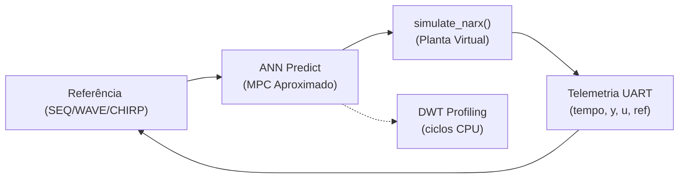
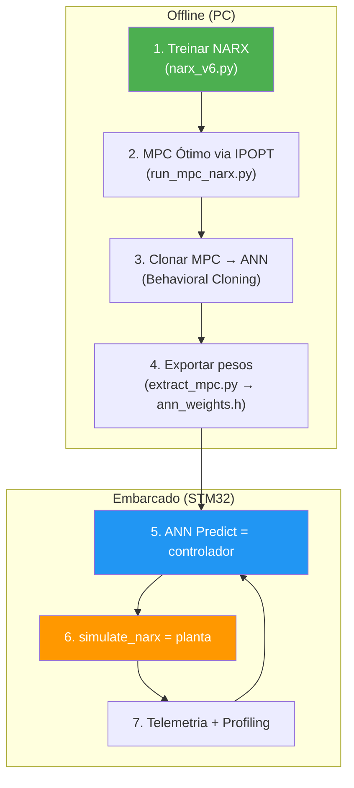

# Análise do SIL Embarcado — MPC-NARX no STM32F446

## O que você já tem implementado

O firmware em [`aeropendulo_main.c`](file:///c:/Users/vicio/Documents/SYSTEM-IDENTIFICATION-AERO-main/stm-sil/Core/Src/aeropendulo_main.c) já faz **exatamente** o que você descreveu, usando o `#define SIL_MODE`:



### ✅ O que está correto

| Item | Status | Detalhes |
|------|--------|---------|
| **NARX como planta virtual** | ✅ Correto | [`simulate_narx()`](file:///c:/Users/vicio/Documents/SYSTEM-IDENTIFICATION-AERO-main/stm-sil/Core/Src/aeropendulo_main.c#L685-L712) usa modelo polinomial `ny=5, nu=5, l=2` com FIFO shift |
| **ANN como controlador MPC** | ✅ Correto | [`ann_predict()`](file:///c:/Users/vicio/Documents/SYSTEM-IDENTIFICATION-AERO-main/stm-sil/Core/Src/aeropendulo_main.c#L718-L759) executa rede 20→128→128→1 (ReLU) com StandardScaler |
| **Perfilagem de tempo** | ✅ Correto | Usa DWT cycle counter (`c2-c1`), reporta média a cada 100 ticks via UART |
| **Hardware desabilitado no SIL** | ✅ Correto | `#ifndef SIL_MODE` guarda todo acesso a IMU/ESC |
| **Pesos hardcoded** | ✅ Correto | [`ann_weights.h`](file:///c:/Users/vicio/Documents/SYSTEM-IDENTIFICATION-AERO-main/stm-sil/Core/Inc/ann_weights.h) (435 KB) contém `W0[2560]`, `W1[16384]`, `W2[128]`, `scaler_mean/scale` |

### ⚠️ Pontos de Atenção

#### 1. A ANN mede tempo, mas o NARX não
O profiling mede apenas `ann_predict()` (linhas 857-861). **Falta medir `simulate_narx()`** separadamente. Para comparação justa com um MPC real, você deveria reportar:
- Tempo da ANN (controlador)
- Tempo do NARX (planta)
- Tempo total do ciclo (controlador + planta + overhead)

```c
// Sugestão: adicionar profiling ao NARX também
uint32_t c_narx1 = DWT->CYCCNT;
simulate_narx(u);
uint32_t c_narx2 = DWT->CYCCNT;
```

#### 2. O NARX embarcado é diferente do NARX no Python MPC

| | NARX no STM32 (`simulate_narx`) | NARX no Python (`run_mpc_narx.py`) |
|---|---|---|
| **Tipo** | Polinomial (10 termos, `ny=5, nu=5, l=2`) | Rede Neural (`ny=30, nu=50`, 256→128→1, Tanh + bypass) |
| **Complexidade** | ~20 multiplicações | ~50K multiplicações |
| **Modelo** | Equação explícita hardcoded | PyTorch → CasADi simbólico |

> [!WARNING]
> São **dois modelos NARX completamente diferentes**. O NARX polinomial embarcado é muito mais simples que o NARX neural usado no treinamento do MPC pelo IPOPT. Isso significa que a planta simulada no STM32 se comporta diferente da planta que o MPC ótimo "viu" durante o treinamento da ANN. Pode causar drift no controle.

#### 3. Dimensões da ANN: entrada 20, mas o estado tem dimensão diferente

No [`hil_ann_mpc.py`](file:///c:/Users/vicio/Documents/SYSTEM-IDENTIFICATION-AERO-main/MPC_Hardware_Test/hil_MPC_ANN/hil_ann_mpc.py), a ANN espera `nx + N = 10 + 10 = 20` entradas, com `ny_model=5, nu_model=5, N=10`.

No STM32, a entrada é montada assim (linha 847-855):
```c
nn_in[0..4]  = sil_y_hist[0..4]   // 5 últimos y
nn_in[5..9]  = sil_u_hist[0..4]   // 5 últimos u
nn_in[10..19] = r (constante)     // 10 pontos de ref futura
```

Isso **bate corretamente** com a dimensão da ANN. ✅

#### 4. Normalização ausente no NARX

A ANN usa `StandardScaler` na entrada (linhas 724-728), mas o `simulate_narx()` opera em **graus diretos** (sem normalização). Porém a ANN foi treinada com dados normalizados. Se a escala estiver consistente (todas em graus), isso está OK. Mas verifique se a ANN do [`hil_ann_mpc.py`](file:///c:/Users/vicio/Documents/SYSTEM-IDENTIFICATION-AERO-main/MPC_Hardware_Test/hil_MPC_ANN/hil_ann_mpc.py) foi treinada com as mesmas unidades.

> [!IMPORTANT]
> No [`run_mpc_narx.py`](file:///c:/Users/vicio/Documents/SYSTEM-IDENTIFICATION-AERO-main/mpc-control/run_mpc_narx.py), os dados são **normalizados para [-1,1]** com MinMaxScaler. Se a ANN embarcada foi treinada com dados nessa escala e o `simulate_narx()` está em graus, haverá **mismatch de escala** catastrófico.

#### 5. Stack e Heap podem ser insuficientes

```
HeapSize  = 0x200  (512 bytes)
StackSize = 0x400  (1024 bytes)
```

A `ann_predict()` aloca `float h1[128]` + `float h2[128]` + `float norm_input[20]` = **1104 bytes na stack**. O stack size de 1024 bytes vai causar **stack overflow**!

> [!CAUTION]
> **Stack overflow garantido!** `ann_predict()` sozinha precisa de ~1.1 KB de stack, mas o `.ioc` configura apenas 0x400 (1024 bytes). Aumente para no mínimo `0x1000` (4 KB) no IOC: `ProjectManager.StackSize=0x1000`. O heap também deve ser aumentado para `0x800`.

## Veredicto

### A ideia conceitual está ✅ Correta:
1. **NARX simula a planta** (aeropêndulo virtual) — substitui o hardware real
2. **ANN aproxima o MPC** — faz inferência rápida em vez de resolver o IPOPT online
3. **Profiling com DWT** — mede ciclos de CPU por iteração

### Mas há bugs críticos para corrigir:

| Prioridade | Bug | Fix |
|------------|-----|-----|
| 🔴 Crítico | Stack overflow (1024 < 1104 bytes) | Aumentar para 0x1000 no .ioc |
| 🟠 Alto | Possível mismatch de escala NARX↔ANN | Verificar se ambos usam graus ou [-1,1] |
| 🟡 Médio | Profiling só mede ANN, não NARX | Adicionar DWT ao `simulate_narx()` |
| 🟡 Médio | Modelos NARX inconsistentes (polinomial vs neural) | Documentar ou alinhar |

## Fluxo Pipeline Completo



O pipeline está conceitualmente sólido. O STM32 roda o **Software-in-the-Loop (SIL)** puro, sem hardware, para validar que a ANN+NARX cabe no microcontrolador com timing adequado antes de conectar o hardware real.
