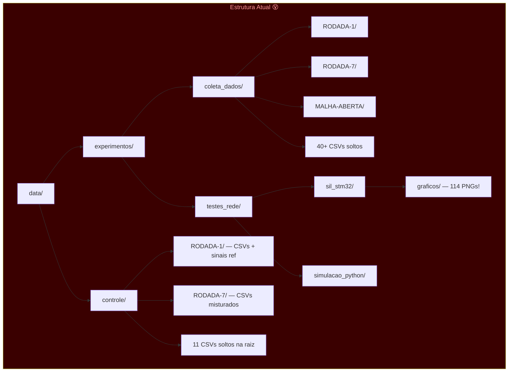
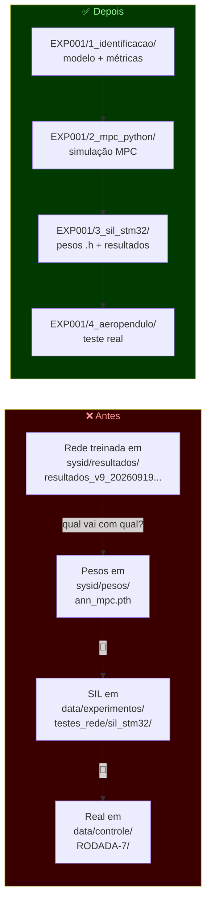

# Proposta de Reorganização — Pasta `data/`

## Diagnóstico: Por que está confuso hoje?



### Problemas identificados:

| # | Problema | Onde |
|---|---------|------|
| 1 | **CSVs soltos na raiz** junto com RODADAs — não se sabe a qual contexto pertencem | `coleta_dados/`, `controle/` |
| 2 | **`testes_rede/` mistura modelo + plataforma** — só separa `sil_stm32` vs `simulacao_python`, mas não diz *qual modelo* gerou os dados | `testes_rede/` |
| 3 | **`graficos/` com 114 PNGs sem nome legível** — são hashes de memória, impossível saber o que é | `sil_stm32/graficos/` |
| 4 | **Sem link entre identificação → MPC → teste** — os resultados de `sysid/resultados/` estão separados dos testes de controle em `data/controle/` |
| 5 | **`data/controle/RODADA-N`** não indica qual modelo/rede foi usada naquela rodada |
| 6 | **36 pastas de resultados** em `sysid/resultados/` sem indexação clara de qual é a "boa" |
| 7 | **Notebooks IDENT-HELON** salvam artefatos (CSVs, .h) na mesma pasta do código |

---

## Proposta: Estrutura Orientada a Experimentos

A ideia central: **cada experimento completo tem um ID e uma pasta autocontida** com tudo que foi produzido nele — desde a rede treinada até os resultados no aeropêndulo real.

```
data/
├── coletas/                          ← Dados brutos do aeropêndulo (IMUTÁVEIS)
│   ├── RODADA-1_20260731/            ← Data no nome para ordenar
│   │   ├── README.md                 ← Descrição: condições, setup, data, notas
│   │   ├── multi-sine-1_0731_17-31.csv
│   │   └── ...
│   ├── RODADA-2_20260804/
│   ├── ...
│   ├── RODADA-7_20260904/
│   └── MALHA-ABERTA_20260917/
│
├── experimentos/                     ← Um subdiretório por experimento E2E
│   ├── EXP001_node-v9_mix/           ← ID + modelo + nome curto
│   │   ├── README.md                 ← Metadados do experimento (ver template)
│   │   ├── config.json               ← Hiperparâmetros congelados
│   │   │
│   │   ├── 1_identificacao/          ← Etapa 1: treinar modelo
│   │   │   ├── modelo_best.pth       ← Checkpoint do melhor modelo
│   │   │   ├── training_log.csv      ← Loss por época
│   │   │   ├── freerun_teste.png     ← Gráfico de validação free-run
│   │   │   └── metricas.json         ← RMSE, R², FIT%
│   │   │
│   │   ├── 2_mpc_python/             ← Etapa 2: MPC simulado no PC
│   │   │   ├── simulacao.csv
│   │   │   ├── simulacao.png
│   │   │   └── metricas_mpc.json     ← Tempo de cálculo, tracking error, etc.
│   │   │
│   │   ├── 3_sil_stm32/             ← Etapa 3: Software-in-the-Loop na STM
│   │   │   ├── ann_weights.h         ← Pesos exportados para C
│   │   │   ├── simulacao_sil.csv
│   │   │   ├── comparacao_python_stm.png
│   │   │   └── metricas_sil.json
│   │   │
│   │   └── 4_aeropendulo/           ← Etapa 4: Teste no hardware real
│   │       ├── teste_20260925_1727.csv
│   │       ├── teste_20260925_1727.png
│   │       └── metricas_real.json
│   │
│   ├── EXP002_narx_mpc/
│   │   ├── README.md
│   │   ├── config.json
│   │   ├── 1_identificacao/
│   │   ├── 2_mpc_python/
│   │   ├── 3_sil_stm32/
│   │   └── 4_aeropendulo/
│   │
│   └── ...
│
└── sinais_referencia/                ← Sinais de entrada pré-definidos (templates)
    ├── aprbs-60-1.csv
    ├── chirp-60-amp50.csv
    ├── referencia_mpc.csv
    └── wave_mpc_treino.csv
```

---

## Template do `README.md` de cada Experimento

```markdown
# EXP001 — NODE v9 Mix

| Campo           | Valor                                    |
|-----------------|------------------------------------------|
| **Data início** | 2026-09-20                               |
| **Modelo**      | PhysicsODE_Asymmetric (node_v9.py)       |
| **Dados treino**| RODADA-5 (A–D) + RODADA-3 (E) — Mix     |
| **Dados teste** | RODADA-2 + RODADA-4                      |
| **Status**      | ✅ Completo até etapa 4                  |

## Resultados Resumidos

| Plataforma     | RMSE (°) | R²     | Notas            |
|----------------|----------|--------|------------------|
| Python (MPC)   | 2.31     | 0.987  | Horizonte N=20   |
| STM32 SIL      | 2.45     | 0.985  | Fixed-point OK   |
| Aeropêndulo    | 3.12     | 0.971  | Vibração em 40°+ |

## Observações
- Modelo convergiu em ~1200 épocas
- SIL diverge levemente após 60s — investigar quantização
```

---

## Template do `config.json`

```json
{
  "experimento_id": "EXP001",
  "modelo": {
    "tipo": "PhysicsODE_Asymmetric",
    "script": "sysid/scripts/node_v9.py",
    "versao": "v9",
    "n_parametros": 5
  },
  "treinamento": {
    "epocas": 2000,
    "lr_inicial": 0.015,
    "scheduler": "CosineAnnealing",
    "seed": 0,
    "batch_size": 1024,
    "k_min": 20,
    "k_max": 400
  },
  "dados": {
    "treino": ["RODADA-5/aprbs-*.csv", "RODADA-5/multi-seno-*.csv", "..."],
    "validacao": ["RODADA-3/chirp-1_0807_16-32.csv"],
    "teste": ["RODADA-2/multi-seno-1_*.csv", "RODADA-4/aprbs-2_*.csv", "..."]
  },
  "coletas_usadas": ["RODADA-5_20260827", "RODADA-3_20260807", "RODADA-2_20260804", "RODADA-4_20260819"]
}
```

---

## Comparação Visual da Mudança



---

## O que fazer com `sysid/`?

`sysid/` continua sendo o **código-fonte** (scripts, notebooks). Não muda! O que muda é para **onde os resultados vão**.

| Pasta | Papel | Muda? |
|-------|-------|-------|
| `sysid/scripts/` | Código dos modelos (node_v3.py, etc.) | ❌ Fica |
| `sysid/notebooks/` | Notebooks de exploração | ❌ Fica |
| `sysid/resultados/` | → Mover para dentro dos `EXP*/1_identificacao/` | ✅ Migrar |
| `sysid/pesos/` | → Mover para dentro dos `EXP*/1_identificacao/` ou `3_sil_stm32/` | ✅ Migrar |
| `sysid/modelos_salvos/` | → Mover para dentro dos `EXP*/1_identificacao/` | ✅ Migrar |

---

## Regras Práticas (Resumo)

> [!IMPORTANT]
> ### As 5 regras de ouro
> 1. **Coletas são sagradas** — nunca modifique os CSVs brutos em `data/coletas/`
> 2. **Um experimento = uma pasta** — tudo que foi produzido junto fica junto
> 3. **Etapas numeradas** — `1_`, `2_`, `3_`, `4_` indicam a ordem do pipeline
> 4. **README + config.json** — todo experimento é auto-documentado
> 5. **Nomeie com ID** — `EXP001`, `EXP002`, etc. para referência rápida

---

## Script de Migração

Para não mover manualmente, posso criar um script Python que:
1. Cria a estrutura `data/coletas/` movendo as RODADAs de `coleta_dados/`
2. Move os CSVs soltos para `data/sinais_referencia/`
3. Cria um `EXP001` de template com a estrutura de subpastas
4. Gera READMEs automáticos para cada RODADA

> [!NOTE]
> A migração não precisa ser feita toda de uma vez. Você pode:
> - **Fase 1**: Criar a nova estrutura e os próximos experimentos já usar o formato novo
> - **Fase 2**: Migrar gradualmente os resultados antigos quando precisar referenciá-los

---

## Próximos passos sugeridos

1. **Validar esta proposta** — Tem alguma etapa que não se encaixa? Algum tipo de artefato que esqueci?
2. **Criar o script de migração** — Posso gerar o script que reorganiza automaticamente
3. **Criar template de experimento** — Um script `novo_experimento.py` que cria a pasta com a estrutura pronta
