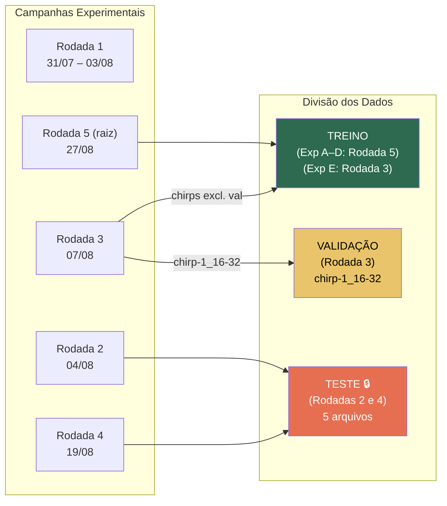
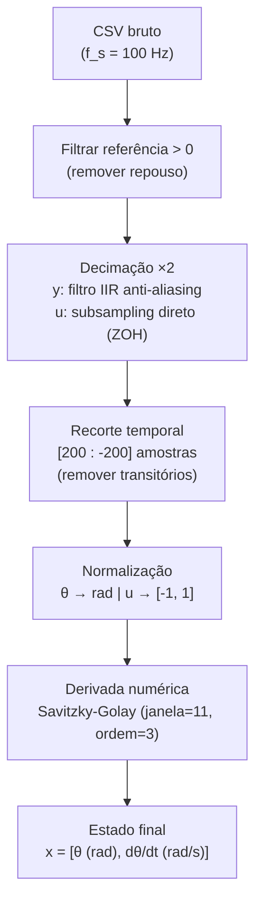
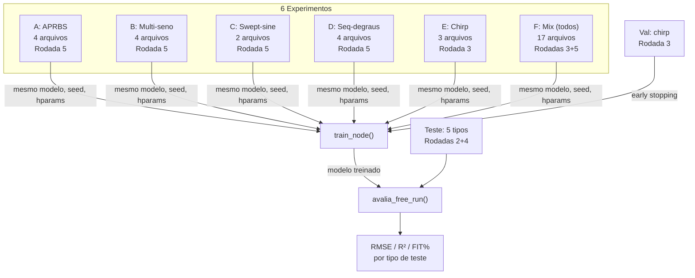

# Protocolo de Treinamento e Metodologia Experimental — NODE v6

## Estudo Comparativo de Sinais de Excitação para Identificação de Sistemas via Neural ODEs

---

## 1. Introdução e Objetivo

O presente estudo investiga a influência do tipo de sinal de excitação utilizado no treinamento sobre a capacidade de generalização de modelos baseados em **Neural Ordinary Differential Equations** (Neural ODEs) aplicados à identificação de um aeropêndulo.

A pergunta central é:

> *Dado um mesmo modelo e os mesmos hiperparâmetros, qual tipo de sinal de excitação no conjunto de treino produz o modelo NODE mais generalizável?*

Para responder, seis experimentos (A–F) são conduzidos sob condições idênticas, variando-se exclusivamente o conjunto de dados de treinamento. A avaliação é feita em **simulação livre** (*free-run*) sobre datasets de teste de sessões experimentais completamente distintas (*cross-session*), cobrindo todos os cinco tipos de excitação.

---

## 2. Descrição da Planta

O sistema sob estudo é um **aeropêndulo de 1 grau de liberdade (1-DOF)**: uma haste articulada em torno de um eixo horizontal, acionada por um motor com hélice em uma extremidade e balanceada por um contrapeso na outra.

### 2.1 Parâmetros Físicos Conhecidos

| Parâmetro | Símbolo | Valor | Unidade |
|:---|:---:|:---:|:---:|
| Massa da hélice + motor | $m_1$ | 0.122 | kg |
| Comprimento ao motor | $L_1$ | 0.39 | m |
| Massa do contrapeso | $m_2$ | 0.055 | kg |
| Comprimento ao contrapeso | $L_2$ | 0.347 | m |
| Aceleração gravitacional | $g$ | 9.81 | m/s² |

### 2.2 Variáveis do Sistema

| Variável | Símbolo | Descrição |
|:---|:---:|:---|
| Entrada | $u(t)$ | Comando do motor (% do PWM), normalizado para $[-1, 1]$ |
| Saída | $\theta(t)$ | Ângulo da haste (rad) |
| Estado | $\mathbf{x}(t) = [\theta,\, \dot{\theta}]^\top$ | Posição angular e velocidade angular |

### 2.3 Instrumentação e Aquisição

- **Sensor de ângulo**: encoder ou potenciômetro no eixo de rotação
- **Taxa de amostragem nativa**: $f_s = 100$ Hz ($\Delta t_{\text{raw}} = 0{,}010$ s)
- **Taxa efetiva após decimação**: $f_s' = 50$ Hz ($\Delta t = 0{,}020$ s)
- **Controlador**: microcontrolador (Arduino/STM32) com comunicação serial

---

## 3. Modelo — Physics-Informed Neural ODE Assimétrico

### 3.1 Formulação Dinâmica

O modelo segue a forma de uma equação diferencial ordinária parametrizada, onde os parâmetros físicos desconhecidos são estimados via otimização baseada em gradiente:

$$
\dot{\mathbf{x}}(t) = f_\phi(\mathbf{x}(t),\, u(t))
$$

Especificamente, a dinâmica é descrita por:

$$
\dot{\theta} = \dot{\theta}
$$

$$
\ddot{\theta} = \frac{1}{J} \left[ \tau_{\text{motor}}(u) - \tau_{\text{grav}}(\theta) - \tau_{\text{atrito}}(\dot{\theta}) \right]
$$

onde:

| Torque | Expressão | Descrição |
|:---|:---|:---|
| Motor | $\tau_{\text{motor}} = G_u(u) \cdot u \cdot |u|$ | Torque aerodinâmico (quadrático em $u$) |
| Gravitacional | $\tau_{\text{grav}} = (m_1 L_1 - m_2 L_2)\, g\, \sin\theta$ | Torque restaurador/desestabilizador |
| Atrito | $\tau_{\text{atrito}} = b(\dot{\theta}) \cdot \dot{\theta}$ | Atrito viscoso assimétrico |

### 3.2 Assimetria Direção-Dependente

Para capturar a assimetria física do sistema (diferenças no atrito e no empuxo entre rotação horária/anti-horária e entre comando positivo/negativo), os coeficientes de atrito e ganho do motor são modelados como funções suaves da direção:

$$
b(\dot{\theta}) = \sigma(50\,\dot{\theta}) \cdot b^+ + \left[1 - \sigma(50\,\dot{\theta})\right] \cdot b^-
$$

$$
G_u(u) = \sigma(50\,u) \cdot G_u^+ + \left[1 - \sigma(50\,u)\right] \cdot G_u^-
$$

onde $\sigma(\cdot)$ é a função sigmóide logística e o fator 50 produz uma transição rápida (quase-degrau) próxima à origem.

### 3.3 Parâmetros Treináveis

Todos os parâmetros são parametrizados em escala logarítmica para garantir positividade:

| Parâmetro | Notação Interna | Valor Inicial |
|:---|:---:|:---:|
| Momento de inércia | $J = e^{\log J}$ | 1.0 |
| Atrito viscoso (positivo) | $b^+ = e^{\log b^+}$ | $e^{-1} \approx 0.368$ |
| Atrito viscoso (negativo) | $b^- = e^{\log b^-}$ | $e^{-1} \approx 0.368$ |
| Ganho do motor (positivo) | $G_u^+ = e^{\log G_u^+}$ | 1.0 |
| Ganho do motor (negativo) | $G_u^- = e^{\log G_u^-}$ | 1.0 |

**Total: 5 parâmetros treináveis.**

### 3.4 Integração Numérica

A integração da ODE é realizada pelo pacote `torchdiffeq` utilizando o método **Runge-Kutta de 4ª ordem (RK4)** a passo fixo, com interpolação linear do sinal de entrada $u(t)$ via `torch.searchsorted`.

---

## 4. Dados Experimentais

### 4.1 Campanhas de Coleta (Rodadas)

Os dados experimentais foram coletados em cinco sessões (rodadas) independentes, em datas distintas, cada uma potencialmente sob condições ambientais e de setup ligeiramente diferentes:

| Rodada | Data | Conteúdo Principal | Uso no v6 |
|:---:|:---:|:---|:---|
| 1 | 31/07 e 03/08 | Multi-seno, swept-sine, chirp (piloto) | — (não utilizada) |
| 2 | 04/08 | Multi-seno, seq-degraus, chirp | **Teste** |
| 3 | 07/08 | Chirp, seq-degraus, multi-seno, curva semi-estática | **Val** + **Treino (Exp E)** |
| 4 | 19/08 | APRBS, multi-seno, swept-sine, degraus | **Teste** |
| 5 (raiz) | 27/08 | APRBS, multi-seno, swept-sine, seq-degraus | **Treino (Exp A–D)** |

### 4.2 Tipos de Sinais de Excitação

| Tipo | Abreviatura | Característica Espectral |
|:---|:---:|:---|
| APRBS | APRBS | Sinal binário pseudo-aleatório de amplitude, espectro largo e rico em baixas frequências |
| Multi-seno | MultiSeno | Soma de senóides com frequências escolhidas, espectro discreto controlado |
| Swept-sine (chirp linear) | SweptSine | Varredura contínua de frequência, cobertura espectral progressiva |
| Sequência de degraus | Degraus | Degraus de amplitude variada, rico em conteúdo DC e transientes |
| Chirp (logarítmico) | Chirp | Varredura logarítmica de frequência, ênfase proporcional em cada década |

### 4.3 Inventário Completo dos Arquivos Utilizados

#### Treino — Experimentos A–D (Rodada 5, 27/08)

| Experimento | Arquivo | Tipo |
|:---|:---|:---:|
| A_APRBS | `aprbs-1_0827_17-19.csv` | APRBS |
| | `aprbs-2_0827_17-25.csv` | APRBS |
| | `aprbs-3_0827_17-28.csv` | APRBS |
| | `aprbs-4_0827_17-31.csv` | APRBS |
| B_MultiSeno | `multi-seno-1_0827_17-34.csv` | Multi-seno |
| | `multi-seno-2_0827_17-37.csv` | Multi-seno |
| | `multi-seno-3_0827_17-40.csv` | Multi-seno |
| | `multi-seno-4_0827_17-43.csv` | Multi-seno |
| C_SweptSine | `swept-sine-1_0827_17-58.csv` | Swept-sine |
| | `swept-sine-4_0827_18-00.csv` | Swept-sine |
| D_Degraus | `seq-degraus-1_0827_17-46.csv` | Seq-degraus |
| | `seq-degraus-2_0827_17-49.csv` | Seq-degraus |
| | `seq-degraus-3_0827_17-52.csv` | Seq-degraus |
| | `seq-degraus-4_0827_17-55.csv` | Seq-degraus |

#### Treino — Experimento E (Rodada 3, 07/08)

| Experimento | Arquivo | Tipo |
|:---|:---|:---:|
| E_Chirp | `RODADA-3/chirp-1_0807_16-34.csv` | Chirp |
| | `RODADA-3/chirp-2_0807_17-07.csv` | Chirp |
| | `RODADA-3/chirp-2_0807_17-09.csv` | Chirp |

> **Nota:** Não há arquivos de chirp na Rodada 5 (raiz). Os chirps do Exp E são da Rodada 3, porém nenhum deles coincide com o arquivo de validação (`chirp-1_0807_16-32.csv`) nem com o de teste (`RODADA-2/chirp-1_0804_19-19.csv`).

#### Treino — Experimento F: Mix (Controle)

Concatenação sem duplicatas de todos os arquivos dos Experimentos A–E (17 arquivos no total).

#### Validação (*early stopping*)

| Arquivo | Rodada | Tipo |
|:---|:---:|:---:|
| `RODADA-3/chirp-1_0807_16-32.csv` | 3 | Chirp |

Função: monitorar o RMSE em simulação livre a cada 50 épocas. O checkpoint com menor RMSE de validação é restaurado ao final do treinamento.

#### Teste (avaliação final, *locked*)

| Tipo de Teste | Arquivo | Rodada |
|:---|:---|:---:|
| APRBS | `RODADA-4/aprbs-2_0819_18-51.csv` | 4 |
| MultiSeno | `RODADA-2/multi-seno-1_0804_19-06.csv` | 2 |
| SweptSine | `RODADA-4/swept-sine-1_0819_19-02.csv` | 4 |
| Degraus | `RODADA-2/seq-degraus-2_0804_19-38.csv` | 2 |
| Chirp | `RODADA-2/chirp-1_0804_19-19.csv` | 2 |

> **Princípio de separação cross-session:** Nenhum arquivo de teste pertence à mesma rodada dos dados de treino dos Experimentos A–D (Rodada 5). Todos os testes são de sessões anteriores (Rodadas 2 e 4), garantindo avaliação em condições experimentais independentes.

---

## 5. Protocolo de Divisão dos Dados

A divisão dos dados segue o princípio de **cross-session validation** recomendado na literatura de identificação de sistemas (Ljung, 1999; Schoukens & Ljung, 2019):

### 5.1 Regras de Separação

1. **Nenhum arquivo aparece em mais de um split** (treino, validação ou teste).
2. **O conjunto de teste é fixo e bloqueado**: jamais influencia decisões de treinamento ou seleção de modelo.
3. **A validação guia exclusivamente o early stopping**, não é usada para ajuste de hiperparâmetros entre experimentos (todos usam os mesmos hiperparâmetros).
4. **Separação temporal/por sessão**: treino e teste vêm de rodadas diferentes, minimizando viés por condições experimentais compartilhadas.

---

## 6. Pré-Processamento

O pipeline de pré-processamento é idêntico para todos os conjuntos (treino, validação e teste):

### 6.1 Etapas

### 6.2 Parâmetros

| Parâmetro | Valor | Justificativa |
|:---|:---:|:---|
| Fator de decimação | 2 | Reduz custo computacional mantendo banda útil ($f_{\text{Nyquist}}' = 25$ Hz $\gg$ banda do sistema) |
| Amostras cortadas (início) | 200 | Remove transitório inicial e artefatos de acionamento |
| Amostras cortadas (fim) | 200 | Remove artefatos de desligamento |
| Savitzky-Golay: janela | 11 amostras | Suavização moderada da derivada |
| Savitzky-Golay: ordem | 3 | Polinômio cúbico — adequado para capturar dinâmica suave |
| Normalização de $u$ | $u_{\text{norm}} = \text{clip}(u_{\%} / 100,\; -1,\; 1)$ | Escala unitária, saturação nos limites físicos |

---

## 7. Protocolo de Treinamento

### 7.1 Variável Controlada

Todos os seis experimentos utilizam:
- **Mesmo modelo**: `PhysicsODE_Asymmetric` (5 parâmetros)
- **Mesma inicialização**: `torch.manual_seed(0)` e `np.random.seed(0)` resetados antes de cada experimento
- **Mesmos hiperparâmetros**: descritos na Tabela abaixo

A **única variável** entre experimentos é o **conjunto de dados de treino**.

### 7.2 Hiperparâmetros (Fixos)

| Hiperparâmetro | Valor | Descrição |
|:---|:---:|:---|
| Épocas | 2000 | Número total de iterações de treinamento |
| Learning rate inicial | 0.015 | Taxa de aprendizado do Adam |
| Scheduler | CosineAnnealing | Decaimento suave do LR até 0 em $T_{\max} = 2000$ |
| $k_{\min}$ | 20 passos | Horizonte mínimo de predição (0.4 s) |
| $k_{\max}$ | 400 passos | Horizonte máximo de predição (8.0 s) |
| Estágio do currículo | 400 épocas | Intervalo entre dobras do horizonte |
| Batch size base | 1024 | Nº de janelas amostradas por época (total, todos os datasets) |
| Integrador | RK4 | Runge-Kutta 4ª ordem a passo fixo |
| Val check | cada 50 épocas | Frequência da avaliação de validação |

### 7.3 Curriculum Learning

O horizonte de predição $k$ cresce exponencialmente ao longo do treinamento, em estágios discretos:

$$
k(\text{epoch}) = \min\left(k_{\min} \cdot 2^{\lfloor \text{epoch} / E_{\text{stage}} \rfloor},\; k_{\max}\right)
$$

| Estágio | Épocas | $k$ (passos) | Horizonte temporal | Batch size efetivo |
|:---:|:---:|:---:|:---:|:---:|
| 0 | 1–399 | 20 | 0.40 s | 1024 |
| 1 | 400–799 | 40 | 0.80 s | 512 |
| 2 | 800–1199 | 80 | 1.60 s | 256 |
| 3 | 1200–1599 | 160 | 3.20 s | 128 |
| 4 | 1600–2000 | 320 | 6.40 s | 64 |

**Motivação:** iniciar com horizontes curtos estabiliza os gradientes nas primeiras épocas (quando os parâmetros ainda estão longe dos valores corretos) e progressivamente força o modelo a capturar dinâmica de longo prazo (Chen et al., 2018; Turan et al., 2022).

O batch size é reduzido inversamente ao horizonte para manter a carga computacional aproximadamente constante.

### 7.4 Função de Perda

A perda é o erro quadrático médio normalizado pelo desvio padrão de cada estado, acumulado sobre todos os datasets de treino:

$$
\mathcal{L} = \frac{1}{|\mathcal{D}|} \sum_{d \in \mathcal{D}} \frac{1}{B_d \cdot k} \sum_{i=1}^{B_d} \sum_{j=1}^{k} \left\| \frac{\hat{\mathbf{x}}_d^{(i)}(t_j) - \mathbf{x}_d^{(i)}(t_j)}{\boldsymbol{\sigma}_{\mathbf{x}}} \right\|^2
$$

onde:
- $\mathcal{D}$ é o conjunto de datasets de treino do experimento
- $B_d$ é o número de janelas amostradas do dataset $d$
- $\hat{\mathbf{x}}$ é o estado predito pela integração da ODE
- $\mathbf{x}$ é o estado real (medido)
- $\boldsymbol{\sigma}_{\mathbf{x}} = [\sigma_\theta,\, \sigma_{\dot\theta}]$ é o desvio padrão de cada componente do estado calculado sobre todos os dados de treino

A normalização por $\boldsymbol{\sigma}_{\mathbf{x}}$ garante que a posição ($\theta$, tipicamente em dezenas de graus) e a velocidade ($\dot\theta$, tipicamente em rad/s) contribuam de forma equilibrada para a perda.

### 7.5 Amostragem de Janelas

Em cada época, para cada dataset $d$:
1. Sorteia-se aleatoriamente $B_d = \max(1,\, \lfloor B_{\text{base}} / |\mathcal{D}| \rfloor)$ índices iniciais $i_0$
2. Extrai-se a janela $\mathbf{x}_d[i_0 : i_0 + k]$ como alvo
3. Integra-se a ODE a partir de $\mathbf{x}_d[i_0]$ por $k$ passos com a entrada $u_d$ interpolada

### 7.6 Early Stopping com Validação Free-Run

A cada 50 épocas, avalia-se o modelo em **simulação livre completa** sobre o conjunto de validação (chirp da Rodada 3). Se o RMSE em graus for inferior ao melhor registrado, salva-se o checkpoint (*state_dict*). Ao final das 2000 épocas, o modelo é restaurado ao checkpoint com menor RMSE de validação.

---

## 8. Definição dos Experimentos

| Exp | Treino | Nº Arq. | Rodada(s) | Propósito |
|:---:|:---|:---:|:---:|:---|
| A | Somente APRBS | 4 | 5 | Avaliar excitação binária pseudo-aleatória |
| B | Somente Multi-seno | 4 | 5 | Avaliar excitação multi-harmônica |
| C | Somente Swept-sine | 2 | 5 | Avaliar varredura contínua de frequência |
| D | Somente Seq-degraus | 4 | 5 | Avaliar excitação por transientes de degrau |
| E | Somente Chirp | 3 | 3 | Avaliar varredura logarítmica de frequência |
| F | Mix de A–E | 17 | 3 + 5 | **Controle** — diversidade vs. especialização |

---

## 9. Avaliação e Métricas

### 9.1 Simulação Livre (*Free-Run*)

A avaliação é feita em **simulação open-loop completa**: dada a condição inicial real $\mathbf{x}(t_0)$ e a sequência de entrada real $u(t)$, integra-se a ODE por toda a duração do dataset **sem qualquer correção ou reinicialização** do estado. Esta é a métrica definitiva para identificação de sistemas, pois testa a capacidade do modelo de reproduzir a dinâmica autonomamente (Ljung, 1999).

### 9.2 Métricas

Sejam $y_k = \theta_{\text{real}}(t_k)$ e $\hat{y}_k = \theta_{\text{pred}}(t_k)$ em graus, com $N$ amostras:

#### RMSE — Root Mean Square Error
$$
\text{RMSE} = \sqrt{\frac{1}{N} \sum_{k=1}^{N} (y_k - \hat{y}_k)^2} \quad [\text{graus}]
$$

#### R² — Coeficiente de Determinação
$$
R^2 = 1 - \frac{\sum_{k=1}^{N} (y_k - \hat{y}_k)^2}{\sum_{k=1}^{N} (y_k - \bar{y})^2}
$$

#### FIT% — Normalized Root Mean Square Error
$$
\text{FIT} = \left(1 - \frac{\| \mathbf{y} - \hat{\mathbf{y}} \|}{\| \mathbf{y} - \bar{y}\,\mathbf{1} \|}\right) \times 100\%
$$

Equivalente à métrica utilizada pela função `compare` do MATLAB System Identification Toolbox.

### 9.3 Matriz de Generalização

Cada modelo treinado (linhas) é avaliado em cada tipo de teste (colunas), formando uma **matriz 6 × 5** de métricas:

|  | APRBS | MultiSeno | SweptSine | Degraus | Chirp |
|:---|:---:|:---:|:---:|:---:|:---:|
| A_APRBS | ● | ● | ● | ● | ● |
| B_MultiSeno | ● | ● | ● | ● | ● |
| C_SweptSine | ● | ● | ● | ● | ● |
| D_Degraus | ● | ● | ● | ● | ● |
| E_Chirp | ● | ● | ● | ● | ● |
| F_Mix | ● | ● | ● | ● | ● |

Essa matriz permite identificar não apenas qual treino é melhor *em média*, mas também padrões de especialização (e.g., treino X é superior no teste Y mas inferior em Z).

### 9.4 Visualizações Geradas

| Arquivo | Conteúdo |
|:---|:---|
| `treino_{EXP}.png` | Sinais de treino (ângulo e entrada vs. tempo) |
| `freerun_{EXP}.png` | Sobreposição real vs. predito em todos os testes |
| `heatmap_rmse.png` | Matriz 6×5 colorida — RMSE |
| `heatmap_r2.png` | Matriz 6×5 colorida — R² |
| `heatmap_fit.png` | Matriz 6×5 colorida — FIT% |
| `comparativo_geral.png` | Barras de média geral (RMSE, R², FIT%) por experimento |
| `resumo.json` | Todas as métricas em formato estruturado |

---

## 10. Reprodutibilidade

| Aspecto | Garantia |
|:---|:---|
| Seed determinística | `torch.manual_seed(0)` + `np.random.seed(0)` resetados antes de cada experimento |
| Inicialização idêntica | Mesmo construtor `PhysicsODE_Asymmetric()` com valores default |
| Dados versionados | Todos os CSVs hospedados no repositório GitHub com URLs fixas |
| Resultados salvos | Diretório `resultados_v6_{timestamp}/` com modelos `.pth`, plots `.png` e `resumo.json` |

---

## 11. Limitações Conhecidas

1. **Desbalanceamento de dados**: o Experimento C (Swept-sine) possui apenas 2 arquivos enquanto os demais possuem 3–4. O Experimento F (Mix) possui 17 arquivos. Diferenças no volume de dados podem confundir o efeito do tipo de excitação com o efeito da quantidade de dados.

2. **Seed única**: a ausência de múltiplas execuções com sementes diferentes impede a quantificação de intervalos de confiança. Recomenda-se rodar com 3–5 seeds e reportar média ± desvio padrão.

3. **Validação com um único arquivo**: o early stopping depende de um único chirp (Rodada 3). Uma anomalia nesse arquivo específico enviesaria todos os experimentos igualmente.

4. **Proximidade temporal entre val e treino no Exp E**: tanto o treino do Exp E quanto a validação provêm da Rodada 3 (mesma sessão, minutos de diferença), o que pode criar condições experimentais mais similares que para os demais experimentos.

---

## Referências

1. **Chen, R. T. Q., Rubanova, Y., Bettencourt, J., & Duvenaud, D.** (2018). Neural Ordinary Differential Equations. *Advances in Neural Information Processing Systems (NeurIPS)*, 31.

2. **Ljung, L.** (1999). *System Identification: Theory for the User* (2nd ed.). Prentice Hall.

3. **Schoukens, J., & Ljung, L.** (2019). Nonlinear System Identification: A User-Oriented Road Map. *IEEE Control Systems Magazine*, 39(6), 28–99.

4. **Kidger, P., Morrill, J., Foster, J., & Lyons, T.** (2021). Neural Controlled Differential Equations for Irregular Time Series. *Advances in Neural Information Processing Systems (NeurIPS)*, 34.

5. **Turan, C., Shaker, H. R., & Shardt, Y. A. W.** (2022). Physics-informed neural ODEs for learning process dynamics. *Journal of Process Control*, 120, 1–12.

6. **Rackauckas, C., Ma, Y., Martensen, J., et al.** (2020). Universal Differential Equations for Scientific Machine Learning. *arXiv preprint arXiv:2001.04385*.
