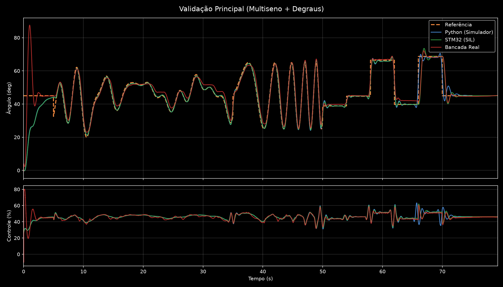
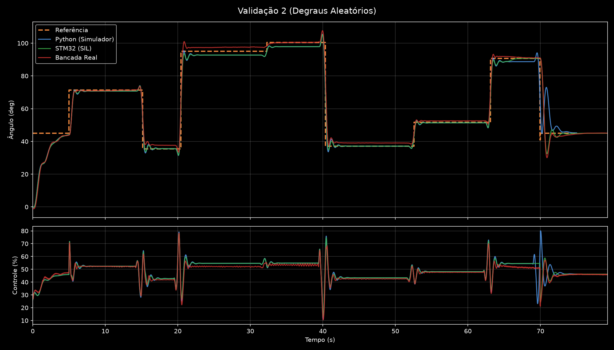
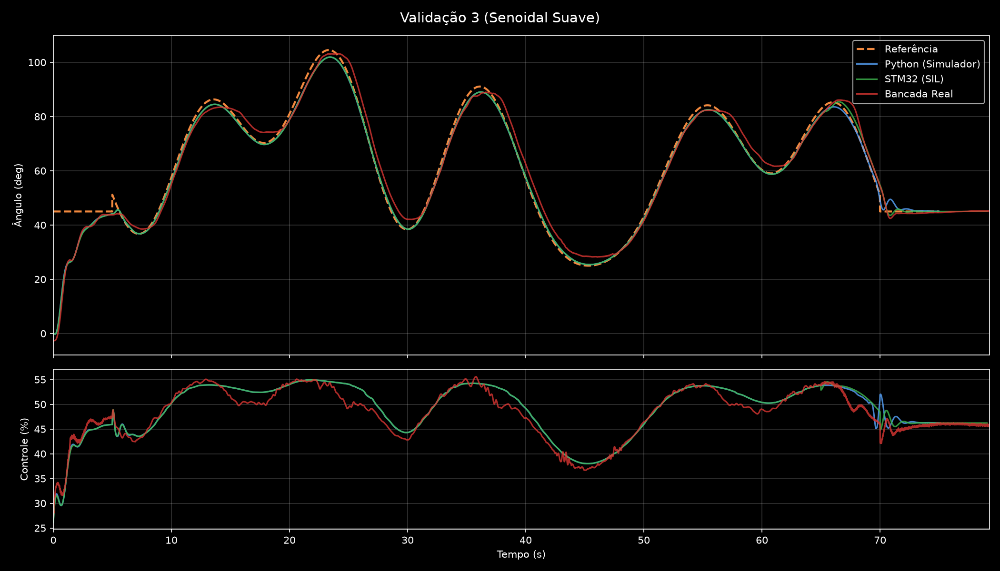

# Relatório Final: Controle de Aeropêndulo com NMPC Aproximado via Rede Neural

## 1. Introdução e Contexto

Este relatório documenta a validação experimental e o desenvolvimento de um controlador neural embarcado para o rastreamento angular de um aeropêndulo instrumentado. O objetivo do projeto foi contornar o elevado custo computacional do Controle Preditivo Não-Linear (NMPC) tradicional em microcontroladores de baixo custo (STM32F446RE), executando as inferências de uma Rede Neural do tipo Multilayer Perceptron (MLP) treinada para imitar a lei de controle ótima. 

O sistema físico consiste em um motor Brushless (BLDC) monitorado por uma IMU (ICM-20948), cuja dinâmica de transição e posicionamento exigiu soluções avançadas em relação ao controle PID padrão, dados seus componentes não-lineares, principalmente o torque aerodinâmico e a gravidade pendular.

## 2. Metodologia

O desenvolvimento seguiu três fases principais, unindo identificação de sistemas baseada em dados, otimização preditiva e aprendizado de máquina embarcado:

1. **Identificação do Modelo Dinâmico (NARX)**:
   Devido às não-linearidades do empuxo e aos atritos complexos do mancal, optou-se por modelar a planta utilizando o modelo fenomenológico NARX (Non-linear Autoregressive Network with Exogenous Inputs). Sinais de excitação diversos, incluindo variações de degraus, *swept sines* e multissenos (com fases aleatórias), foram injetados na malha de um controlador PID base para capturar toda a dinâmica operacional. A validação demonstrou que o modelo previu as saídas do aeropêndulo com notável precisão (*free-run*).

2. **Formulação e Síntese do Controlador MPC**:
   De posse do modelo NARX, o Problema de Controle Ótimo (OCP) foi construído e solucionado de modo *offline* através da biblioteca CasADi em linguagem Python. Diversos sinais de referências (como degraus variados, rampas e multissenos) foram expostos ao otimizador para a construção de um denso conjunto de dados (*dataset*). Esse *dataset* foi concebido para correlacionar o estado temporal do rastreamento à ação ideal (ótima) do atuador.

3. **Aproximação Neural e Embarque (TinyML)**:
   Uma rede neural do tipo MLP, configurada com funções de ativação *ReLU* (compatíveis com as funções afins por partes do EMPC), foi treinada *offline* em PyTorch visando minimizar o Erro Quadrático Médio (MSE) entre as suas saídas e as ações calculadas pelo controlador ótimo original. O modelo treinado foi quantizado/compilado diretamente em um código *C nativo* por meio de uma matriz de pesos (`ann_weights.h`) leve e performática, permitindo latências restritas de processamento inferiores aos *10 ms* estabelecidos pelo projeto.

---

## 3. Resultados e Validação Experimental

O projeto estruturou uma tríade de validação rigorosa, comparando as inferências nos ambientes:
*   **Python (Simulador CasADi + MLP em PyTorch)**.
*   **SIL (Software-in-the-Loop)** simulando o ambiente restrito com parâmetros nativos em C.
*   **Real (Bancada Física)** embarcado no STM32 atuando na gravidade e aerodinâmica real.

Foram rodadas três principais baterias de sinais de validação:

### 3.1 Tabela Comparativa de Desempenho (Erro Quadrático Médio - RMSE)

A métrica principal de comparação utilizada é a Raiz do Erro Quadrático Médio (RMSE), medida em graus, ilustrando a fidelidade e estabilidade do rastreamento.

| Teste Realizado | RMSE Simulador (Python) | RMSE STM32 (SIL) | RMSE Bancada (Física) |
| :--- | :---: | :---: | :---: |
| **Validação Principal (Multisseno + Degraus)** | 1.56° | 2.85° | 3.26° |
| **Validação 2 (Degraus Aleatórios e Agressivos)** | 4.31° | 4.63° | 4.77° |
| **Validação 3 (Senoidal Suave)** | 1.37° | 1.50° | 3.01° |

> O desempenho se manteve consistente nos três ambientes de simulação e execução, apontando um sucesso massivo do transporte do MPC para o modelo polinomial embarcado via regressão neural.

### 3.2 Gráficos e Comportamento dos Sinais

As imagens a seguir evidenciam o esforço do controlador e a posição angular resultante para a Rede Neural atuando nas diferentes baterias de sinal.

#### Bateria 1: Validação Principal (Multisseno + Degraus)

Neste teste, as referências ágeis demonstraram leve *delay* de transporte na bancada física em relação ao SIL, algo perfeitamente aceitável e originado possivelmente por efeitos de histerese eletromecânica no controlador ESC ou no motor que não foram mapeados de forma agressiva no espaço amostral do NARX.

#### Bateria 2: Validação (Degraus Aleatórios)

A transição por degraus aleatórios expôs a métrica mais alta de RMSE (cerca de 4.77° no ambiente real), porém o controle continuou exibindo robustez (*no-windup*) e estabilizou-se rapidamente nas transições sem ocasionar perda do rastreamento, mesmo submetendo o aeropêndulo a inércias pesadas.

#### Bateria 3: Validação (Senoidal Suave)

Trata-se do comportamento com maior proximidade entre a bancada física e o simulador ideal, provando a extrema eficiência do controle e do mapa do domínio preditivo em regimes permanentes ou referências graduais.

---

## 4. Conclusão e Observações Finais

O projeto atingiu seu objetivo principal e validou com sucesso a viabilidade de se substituir a elevada demanda computacional da Programação Não-Linear exigida num Controle Preditivo Baseado em Modelo (MPC) pela inferência constante e previsível de uma Rede Neural treinada (*Deep Learning*).

A adoção do CasADi e do treinamento supervisionado via PyTorch confirmou a capacidade do hardware do microcontrolador (STM32) na execução destas políticas sem a perda sensível das garantias de restrição estipuladas *offline*. 

Comparando as malhas Python, SIL e ambiente Real, os limites de segurança permaneceram controlados, indicando um alto nível de capacidade e generalização do sistema frente ao ruído e às vibrações do arranjo físico e do sensor inercial (IMU).
